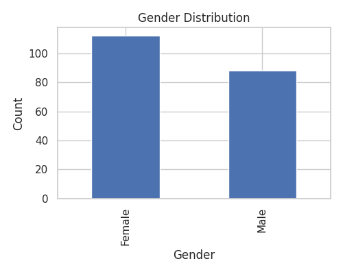
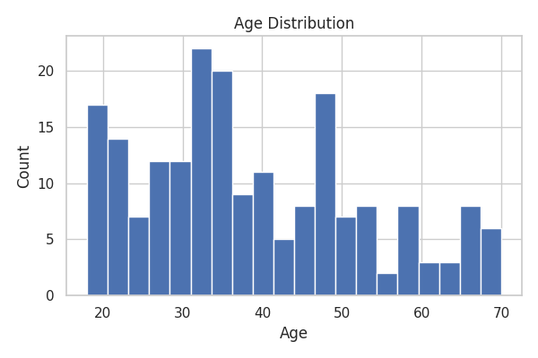
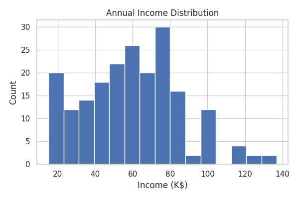
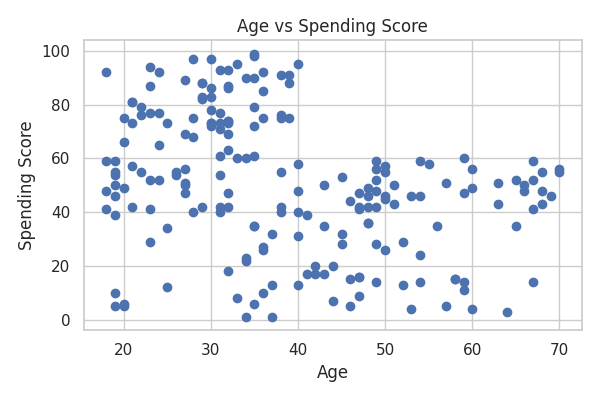
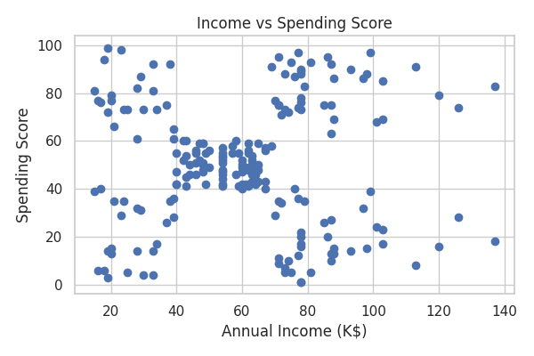
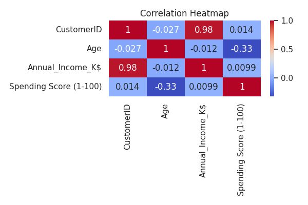

# 📊 Customer Purchase Analysis (Hypothesis Testing + EDA)

This project performs Exploratory Data Analysis (EDA) and statistical hypothesis testing
to analyze customer purchase behavior using the Mall Customer dataset.

## 📌 Project Objective
To understand how customer attributes such as age, gender, and annual income
affect their spending behavior.

## 📊 Dataset
- Name: Mall Customer Segmentation Dataset
- Source: Kaggle
- Total Records: 200

### Features:
- CustomerID
- Genre (Gender)
- Age
- Annual Income (K$)
- Spending Score (1-100)

## 🛠️ Libraries & Tools Used
- Python
- Pandas
- NumPy
- Matplotlib
- Seaborn
- SciPy
- Google Colab

## 🔍 Analysis Performed
- Data loading and cleaning
- Descriptive statistics
- Distribution analysis of Age, Income, and Gender
- Scatter plots to study relationships
- Correlation heatmap
- Hypothesis Testing:
  - T-test: Gender vs Spending Score
  - Pearson Correlation: Age vs Spending Score
  - Chi-square Test: Gender vs Spending Category
  - ANOVA: Spending Score across different age groups

## 📈 Key Insights
- No statistically significant difference in spending between genders.
- Significant negative correlation between age and spending score.
- No strong association between gender and spending category.
- Spending behavior varies significantly across different age groups.

## 📊 Sample Visualizations

## 🚀 How to Run the Project
1. Download or clone this repository.
2. Install dependencies:
   pip install -r requirements.txt
3. Open the notebook `Mall_Customer_Analysis.ipynb` in Jupyter Notebook or Google Colab.
4. Run all cells.

## 📂 Repository Contents
- Mall_Customer_Analysis.ipynb → Colab notebook with code and outputs
- Mall_Customers.csv → Dataset file
- outputs/ → Saved visualization images
- requirements.txt → Python dependencies
- README.md → Project documentation

## ✨ Author
Saloni Meena
